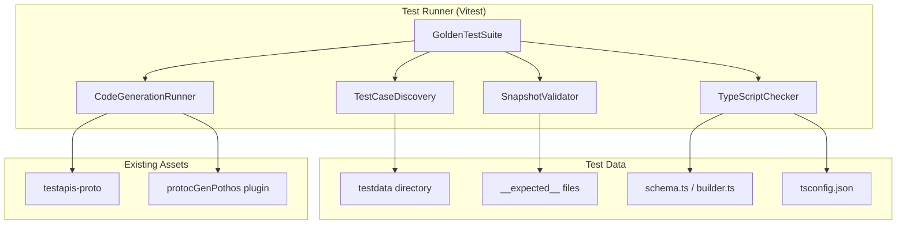
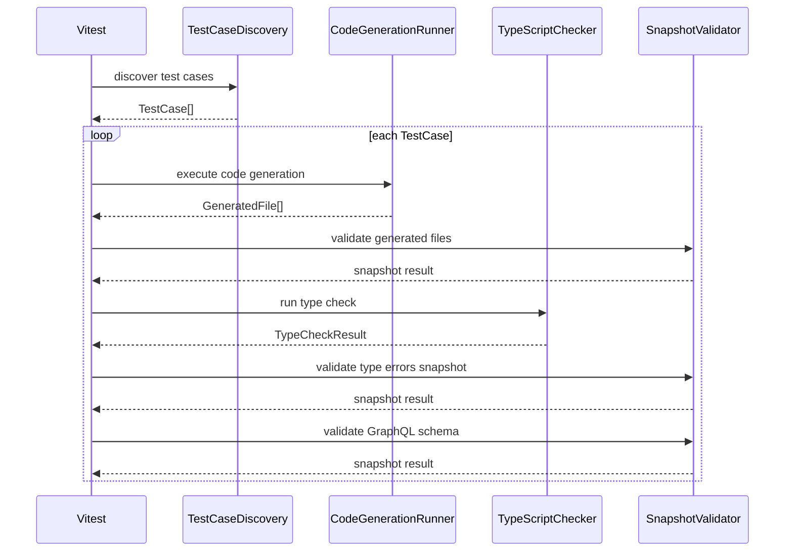

# Technical Design Document

## Overview

**Purpose**: Golden Test への移行は、protoc-gen-pothos パッケージのコード生成テストを統合されたファイルベースのスナップショットテスト形式に統一する。これにより、現在の e2e テストとインラインスナップショットテストの責務重複を解消し、テストカバレッジの正確な測定を可能にする。

**Users**: proto-graphql の開発者が、コード生成ロジックの変更による意図しない出力変更を検出し、生成コードの型安全性を保証するために利用する。

**Impact**: 現在の `/e2e/tests/` ディレクトリの Pothos 関連テストと `plugin.test.ts` のインラインスナップショットを、`tests/golden/` 配下の統一された Golden Test に置き換える。

### Goals

- protoc-gen-pothos パッケージ内で完結するファイルベーススナップショットテストの実現
- 生成コード (`*.pb.pothos.ts`) と GraphQL スキーマ (`schema.graphql`) の両方を検証
- TypeScript 型チェックによる生成コードの型安全性保証
- vitest の標準機能 (`-u` フラグ) によるスナップショット更新

### Non-Goals

- buf CLI を使用したコード生成 (FileDescriptorSet ベースで実現)
- 他のコード生成プラグイン (ts-proto, protobuf-es 自体) のテスト
- 実行時の GraphQL クエリ実行テスト
- パフォーマンスベンチマーク

## Architecture

### Existing Architecture Analysis

現在のテスト構成には以下の課題がある:

- **`plugin.test.ts`**: `toMatchSnapshot()` でインラインスナップショットを使用。生成コードの JSON 表現をテストするが、実際のファイル出力形式ではない
- **`/e2e/tests/`**: buf CLI 経由でコード生成し、`toMatchFileSnapshot()` で GraphQL スキーマを検証。型チェックは tsc によるビルド時検証に依存
- **責務の重複**: 同じテストケースが異なる形式で両方に存在

### Architecture Pattern & Boundary Map



**Architecture Integration**:
- Selected pattern: Modular Test Infrastructure (各検証責務を独立したモジュールに分離)
- Domain/feature boundaries: テストケース発見、コード生成、型チェック、スナップショット検証の4責務
- Existing patterns preserved: `buildCodeGeneratorRequest` によるコード生成、vitest テストフレームワーク
- New components rationale: TypeScript Compiler API による型チェックを新規追加 (gqlkit には存在しなかった機能)
- Steering compliance: TypeScript strict mode、vitest 使用、pnpm workspace 構成を維持

### Technology Stack

| Layer | Choice / Version | Role in Feature | Notes |
|-------|------------------|-----------------|-------|
| Test Framework | vitest (existing) | テスト実行、スナップショット管理 | `toMatchFileSnapshot` 使用 |
| Type Checking | typescript (existing) | 生成コードの型検証 | `ts.createProgram` API 使用 |
| Code Generation | @bufbuild/protoplugin (existing) | CodeGeneratorRequest 処理 | `protocGenPothos.run()` 使用 |
| Test Data | @proto-graphql/testapis-proto (existing) | FileDescriptorSet 提供 | `buildCodeGeneratorRequest` 使用 |
| GraphQL | graphql (existing) | スキーマ SDL 出力 | `printSchema` 使用 |
| TS Runtime | tsx (**新規追加**) | GraphQL スキーマ検証用サブプロセス | devDependency に追加 |

## System Flows

### Test Execution Flow



**Key Decisions**:
- 型チェックはコード生成後に実行 (生成ファイルが存在する必要があるため)
- 型エラーもスナップショット化して意図的なエラー変更を追跡
- GraphQL スキーマ検証は **独立したサブプロセス (tsx)** で実行し、モジュールキャッシュの問題を回避

## Requirements Traceability

| Requirement | Summary | Components | Interfaces | Flows |
|-------------|---------|------------|------------|-------|
| 1.1 | テストケースディレクトリ配置 | TestCaseDiscovery | discoverTestCases | Discovery |
| 1.2 | testapis-proto 命名規則 | TestCaseDiscovery | TestCaseConfig | Discovery |
| 1.3 | 自動ディレクトリ検出 | TestCaseDiscovery | discoverTestCases | Discovery |
| 1.4 | __expected__ 配置 | SnapshotValidator | validateGeneratedFiles | Validation |
| 1.5 | Pothos ファイル配置 | TestCase 構造 | TestCaseConfig | - |
| 1.6 | tsconfig.json 配置 | TypeScriptChecker | runTypeCheck | Type Check |
| 2.1 | buf 非依存コード生成 | CodeGenerationRunner | executeGeneration | Generation |
| 2.2 | toMatchFileSnapshot | SnapshotValidator | validateGeneratedFiles | Validation |
| 2.3 | protobuf ランタイム対応 | TestCaseConfig | param 設定 | - |
| 2.4 | オプションバリエーション | TestCaseConfig | param 設定 | - |
| 2.5 | 差分表示 | vitest 標準機能 | - | - |
| 2.6 | -u フラグ対応 | vitest 標準機能 | - | - |
| 3.1 | tsconfig.json 使用型チェック | TypeScriptChecker | runTypeCheck | Type Check |
| 3.2 | builder.ts/schema.ts 検証 | TypeScriptChecker | runTypeCheck | Type Check |
| 3.3 | 型エラー表示 | TypeScriptChecker | formatDiagnostics | Type Check |
| 3.4 | 型エラースナップショット | SnapshotValidator | validateTypeErrors | Validation |
| 3.5 | 依存パッケージ型解決 | TypeScriptChecker | tsconfig paths 設定 | Type Check |
| 4.1 | GraphQL スキーマスナップショット | SnapshotValidator | validateGraphQLSchema | Validation |
| 4.2 | printSchema 使用 | SnapshotValidator | validateGraphQLSchema | Validation |
| 4.3 | スキーマ差分表示 | vitest 標準機能 | - | - |
| 5.1 | vitest 設定統合 | vitest.config.ts | - | - |
| 5.2 | pnpm test 実行 | package.json scripts | - | - |
| 5.3 | カバレッジ測定 | vitest coverage | - | - |
| 5.4 | 並列実行 | vitest 標準機能 | - | - |
| 6.1 | e2e テストカバー | 全テストケース移行 | - | - |
| 6.2 | e2e 削除 | 移行完了後 | - | - |
| 6.3 | plugin.test.ts 廃止 | 移行完了後 | - | - |
| 6.4 | tests.json 不要化 | ディレクトリベース発見 | - | - |
| 6.5 | 差異ドキュメント化 | migration notes | - | - |

## Components and Interfaces

| Component | Domain/Layer | Intent | Req Coverage | Key Dependencies (P0/P1) | Contracts |
|-----------|--------------|--------|--------------|--------------------------|-----------|
| TestCaseDiscovery | Test Infrastructure | テストケースディレクトリの自動検出と設定読み込み | 1.1, 1.2, 1.3 | fs/promises (P0) | Service |
| CodeGenerationRunner | Test Infrastructure | protoc-gen-pothos によるコード生成実行 | 2.1, 2.3, 2.4 | testapis-proto (P0), protocGenPothos (P0) | Service |
| TypeScriptChecker | Test Infrastructure | TypeScript Compiler API による型チェック実行 | 3.1, 3.2, 3.3, 3.4, 3.5 | typescript (P0) | Service |
| SnapshotValidator | Test Infrastructure | ファイルスナップショットの検証 | 1.4, 2.2, 4.1, 4.2 | vitest (P0), graphql (P1) | Service |
| GoldenTestSuite | Test | 統合テストスイート | 5.1, 5.2, 5.3, 5.4 | All above (P0) | - |

### Test Infrastructure

#### TestCaseDiscovery

| Field | Detail |
|-------|--------|
| Intent | Golden Test のテストケースディレクトリを自動検出し、設定情報を読み込む |
| Requirements | 1.1, 1.2, 1.3 |

**Responsibilities & Constraints**
- `golden/<runtime>/` ディレクトリ配下のサブディレクトリをテストケースとして認識
- `_` プレフィックスのディレクトリは除外
- 各テストケースの `config.json` (オプション) を読み込み
- ディレクトリパスから runtime と proto package を直接取得（変換不要）

**Dependencies**
- External: fs/promises - ディレクトリ走査 (P0)
- Outbound: TestCaseConfig - 設定構造体 (P0)

**Contracts**: Service [x] / API [ ] / Event [ ] / Batch [ ] / State [ ]

##### ディレクトリ構造と命名規則

```
golden/
  <runtime-variant>/            # ランタイム + パラメータバリエーション
    <protopackage>/             # ディレクトリ名 = proto package（変換不要）
      __expected__/
      __generated__/
      builder.ts
      schema.ts
      tsconfig.json
      config.json               # (optional) 追加パラメータ用
```

**runtime-variant の例**:
- `ts-proto` - 標準の ts-proto
- `ts-proto-forcelong` - forceLong=number パラメータ付き ts-proto
- `ts-proto-partial-inputs` - partial_inputs パラメータ付き ts-proto
- `protobuf-es-v1` - protobuf-es v1
- `protobuf-es` - protobuf-es v2

**命名規則**:
- **runtime-variant**: トップレベルディレクトリ名がランタイム種別とパラメータバリエーションを表す
- **proto package**: サブディレクトリ名 = proto package 全体（`testapis.enums` 形式、変換不要）
- **ベース runtime の抽出**: runtime-variant からベースの runtime を抽出（例: `ts-proto-forcelong` → `ts-proto`）

**正規マッピング** (ディレクトリ名 ⇄ proto package ⇄ 生成パス):
```
ディレクトリ名                              proto package                              生成パス
golden/ts-proto/testapis.enums/            testapis.enums                             __generated__/testapis/enums/*.pb.pothos.ts
golden/ts-proto/testapis.edgecases.import_from_same_pkg/  testapis.edgecases.import_from_same_pkg  __generated__/testapis/edgecases/import_from_same_pkg/*.pb.pothos.ts
golden/ts-proto-forcelong/testapis.primitives/  testapis.primitives                   __generated__/testapis/primitives/*.pb.pothos.ts
```

**ルール**:
- ディレクトリ名 = proto package 全体（`testapis.enums`）をそのまま使用
- 生成パスは proto package の `.` を `/` に変換（`testapis.enums` → `testapis/enums/`）

**runtime-variant → ベース runtime のマッピング**:
| runtime-variant | base runtime | 追加パラメータ |
|-----------------|--------------|---------------|
| `ts-proto` | `ts-proto` | なし |
| `ts-proto-forcelong` | `ts-proto` | `forceLong=number` |
| `ts-proto-partial-inputs` | `ts-proto` | `partial_inputs` |
| `protobuf-es-v1` | `protobuf-es-v1` | なし |
| `protobuf-es` | `protobuf-es` | なし |

##### Service Interface
```typescript
interface TestCaseConfig {
  /** proto package 全体 (e.g., "testapis.enums", "testapis.edgecases.import_from_same_pkg") */
  package: string;
  /** runtime-variant (e.g., "ts-proto", "ts-proto-forcelong") */
  runtimeVariant: string;
  /** ベース protobuf ランタイム種別 (runtime-variant から抽出) */
  runtime: "ts-proto" | "protobuf-es-v1" | "protobuf-es";
  /** プラグインパラメータ (optional, runtime-variant から導出) */
  param?: string;
  /** ビルダーパス (relative) */
  builderPath: string;
}

interface TestCase {
  /** テストケース名 (<runtime-variant>/<package>) */
  name: string;
  /** テストケースディレクトリの絶対パス */
  dir: string;
  /** 設定情報 */
  config: TestCaseConfig;
}

interface TestCaseDiscoveryService {
  /**
   * テストケースを検出する
   * @param goldenDir - golden/ ディレクトリの絶対パス
   * @returns 検出されたテストケースの配列
   */
  discoverTestCases(goldenDir: string): Promise<TestCase[]>;
}
```
- Preconditions: goldenDir が存在すること
- Postconditions: テストケース配列を返す (空配列の可能性あり)
- Invariants: `_` プレフィックスディレクトリは常に除外

**Implementation Notes**
- Integration: `<runtime-variant>/<package>` の2階層構造でテストケースを特定
- Validation: runtime-variant が既知のマッピングに存在することを検証
- Risks: ディレクトリ構造が不正な場合の明確なエラーメッセージが必要

#### CodeGenerationRunner

| Field | Detail |
|-------|--------|
| Intent | testapis-proto の FileDescriptorSet から CodeGeneratorRequest を構築し、protoc-gen-pothos によるコード生成を実行 |
| Requirements | 2.1, 2.3, 2.4 |

**Responsibilities & Constraints**
- `buildCodeGeneratorRequest` で CodeGeneratorRequest を構築
- `protocGenPothos.run()` でコード生成を実行
- 生成結果を `GeneratedFile[]` として返却
- buf CLI への依存なし

**Dependencies**
- External: @proto-graphql/testapis-proto - FileDescriptorSet 提供 (P0)
- External: protocGenPothos - コード生成プラグイン (P0)

**Contracts**: Service [x] / API [ ] / Event [ ] / Batch [ ] / State [ ]

##### Service Interface
```typescript
interface GeneratedFile {
  /** 出力ファイル名 (relative path) */
  name: string;
  /** 生成されたコード内容 */
  content: string;
}

interface CodeGenerationResult {
  /** 生成されたファイル */
  files: GeneratedFile[];
  /** エラーメッセージ (失敗時) */
  error?: string;
}

interface CodeGenerationRunnerService {
  /**
   * コード生成を実行する
   * @param testCase - テストケース設定
   * @returns 生成結果
   */
  executeGeneration(testCase: TestCase): CodeGenerationResult;
}
```
- Preconditions: testCase.config.package が testapisPackages に含まれること
- Postconditions: 成功時は files に生成ファイルが含まれる
- Invariants: buf CLI を呼び出さない

**Implementation Notes**
- Integration: 既存の `buildCodeGeneratorRequest` と `protocGenPothos.run()` をそのまま利用
- Validation: 不正なパッケージ名の場合は明確なエラーを返す
- Risks: protobuf ランタイム種別による param 構築の複雑さ

#### TypeScriptChecker

| Field | Detail |
|-------|--------|
| Intent | TypeScript Compiler API を使用して生成コードと schema.ts/builder.ts の型チェックを実行 |
| Requirements | 3.1, 3.2, 3.3, 3.4, 3.5 |

**Responsibilities & Constraints**
- 各テストケースの `tsconfig.json` を読み込み
- `ts.createProgram()` で TypeScript プログラムを構築
- `ts.getPreEmitDiagnostics()` で型エラーを取得
- エラーメッセージをスナップショット可能な形式にフォーマット

**Dependencies**
- External: typescript - Compiler API (P0)

**Contracts**: Service [x] / API [ ] / Event [ ] / Batch [ ] / State [ ]

##### Service Interface
```typescript
interface TypeCheckDiagnostic {
  /** ファイルパス (相対) */
  file: string;
  /** 行番号 (1-indexed) */
  line: number;
  /** 列番号 (1-indexed) */
  character: number;
  /** エラーメッセージ */
  message: string;
  /** エラーコード */
  code: number;
}

interface TypeCheckResult {
  /** 型エラーの有無 */
  success: boolean;
  /** 診断結果 */
  diagnostics: TypeCheckDiagnostic[];
  /** スナップショット用にフォーマットされたエラー文字列 */
  formattedErrors: string;
}

interface TypeScriptCheckerService {
  /**
   * 型チェックを実行する
   * @param testCase - テストケース
   * @param generatedFiles - 生成されたファイル (ファイルシステムに書き込み済み)
   * @returns 型チェック結果
   */
  runTypeCheck(testCase: TestCase): TypeCheckResult;
}
```
- Preconditions: testCase.dir/tsconfig.json が存在すること
- Postconditions: 型エラーがある場合はテスト失敗とする（期待される型エラーは存在しない前提）
- Invariants: パス区切り文字を正規化してスナップショットの安定性を確保

**Implementation Notes**
- Integration: tsconfig.json は e2e テストと同様に `@proto-graphql/tsconfig` を extends
- Validation: tsconfig.json が見つからない場合はエラーを報告
- Risks: node_modules 解決が正しく機能するか確認が必要

##### tsconfig.json 設計

**依存関係の解決方針**:
testapis パッケージ（`@proto-graphql/testapis-ts-proto`, `@proto-graphql/testapis-protobuf-es` など）を `protoc-gen-pothos` の devDependencies に追加することで、`paths` 設定なしで node_modules 経由で解決する。

```json
// packages/protoc-gen-pothos/package.json
{
  "devDependencies": {
    "@proto-graphql/testapis-ts-proto": "workspace:*",
    "@proto-graphql/testapis-protobuf-es": "workspace:*",
    "@proto-graphql/testapis-protobuf-es-v1": "workspace:*"
  }
}
```

**共通ベース設定** (`golden/tsconfig.base.json`):
```json
{
  "$schema": "https://json.schemastore.org/tsconfig",
  "extends": "@proto-graphql/tsconfig/tsconfig.base.json",
  "compilerOptions": {
    "noEmit": true,
    "preserveSymlinks": true,
    "esModuleInterop": true,
    "moduleResolution": "bundler",
    "module": "ESNext",
    "target": "ES2022"
  }
}
```

**各テストケース設定** (`golden/<runtime-variant>/<package>/tsconfig.json`):
```json
{
  "extends": "../../tsconfig.base.json",
  "compilerOptions": {
    "rootDir": "."
  },
  "include": [
    "builder.ts",
    "schema.ts",
    "__generated__/**/*.ts"
  ]
}
```

**設計ポイント**:
- `noEmit: true`: 型チェックのみ実行、出力ファイル不要
- `preserveSymlinks: true`: pnpm workspace のシンボリックリンクを正しく解決
- `paths` 不使用: devDependencies 経由で解決し、複雑な挙動を回避
- 各テストケースは最小限の設定で共通設定を継承

#### SnapshotValidator

| Field | Detail |
|-------|--------|
| Intent | 生成ファイル、型エラー、GraphQL スキーマのスナップショット検証を実行 |
| Requirements | 1.4, 2.2, 4.1, 4.2 |

**Responsibilities & Constraints**
- vitest の `toMatchFileSnapshot()` を使用
- 生成された `*.pb.pothos.ts` を `__expected__/` 配下のファイルと比較
- 型エラーを `__expected__/type-errors.txt` と比較
- GraphQL スキーマを `__expected__/schema.graphql` と比較

**Dependencies**
- External: vitest - スナップショット機能 (P0)
- External: graphql - printSchema (P1)

**Contracts**: Service [x] / API [ ] / Event [ ] / Batch [ ] / State [ ]

##### Service Interface
```typescript
interface SnapshotValidatorService {
  /**
   * 生成ファイルをスナップショットと比較する
   * @param generatedFile - 生成されたファイル
   * @param expectedPath - 期待されるファイルパス
   */
  validateGeneratedFile(
    content: string,
    expectedPath: string
  ): Promise<void>;

  /**
   * 型エラーをスナップショットと比較する
   * @param formattedErrors - フォーマットされた型エラー文字列
   * @param expectedPath - 期待されるファイルパス
   */
  validateTypeErrors(
    formattedErrors: string,
    expectedPath: string
  ): Promise<void>;

  /**
   * GraphQL スキーマをスナップショットと比較する
   * @param schemaModule - schema.ts モジュールへのパス
   * @param expectedPath - 期待されるファイルパス
   */
  validateGraphQLSchema(
    schemaModule: string,
    expectedPath: string
  ): Promise<void>;
}
```
- Preconditions: vitest 実行コンテキスト内であること
- Postconditions: スナップショット不一致時は vitest がエラーを報告
- Invariants: `-u` フラグでスナップショット更新可能

**Implementation Notes**
- Integration: `expect(content).toMatchFileSnapshot(path)` を使用
- Validation: schema.ts が正常に実行できない場合のエラーハンドリング

##### GraphQL スキーマ検証の実装方針

**問題**: Node.js/vitest で動的 import を使用すると、モジュールキャッシュがテストケース間で残り、生成コードの参照パスが混線する可能性がある。

**解決策**: tsx を使用した独立サブプロセスでスキーマを構築

##### tsx 依存の設定

**package.json への追加**:
```json
{
  "devDependencies": {
    "tsx": "^4.x"
  }
}
```

**PATH 解決方針**: `npx` ではなく、`node_modules/.bin/tsx` を直接参照することで確実性を高める。

##### 実装例

**Note**: ESM 前提のため、import 文では `./schema.js` と拡張子を指定する。tsx は TypeScript ファイル (schema.ts) を ESM として実行し、`.js` 拡張子での import を正しく解決する。`--tsconfig` 指定などの詳細は実装時に検討する。

```typescript
import { execFile } from "node:child_process";
import { promisify } from "node:util";
import { writeFileSync, unlinkSync } from "node:fs";
import { dirname, join } from "node:path";
import { fileURLToPath } from "node:url";

const execFileAsync = promisify(execFile);

// プロジェクトルートの node_modules/.bin/tsx を参照
const __dirname = dirname(fileURLToPath(import.meta.url));
const tsxPath = join(__dirname, "../../../../node_modules/.bin/tsx");

async function buildGraphQLSchema(testCaseDir: string): Promise<string> {
  // ESM 前提: ./schema.js は schema.ts を参照
  const script = `
    import { printSchema } from "graphql";
    import { schema } from "./schema.js";
    console.log(printSchema(schema));
  `;

  const tempScript = join(testCaseDir, "__temp_schema_builder.ts");
  writeFileSync(tempScript, script);

  try {
    const { stdout } = await execFileAsync(tsxPath, [tempScript], {
      cwd: testCaseDir,
      encoding: "utf-8",
    });
    return stdout.trim();
  } finally {
    unlinkSync(tempScript);
  }
}
```

**メリット**:
- 完全に独立したプロセスでモジュールキャッシュの問題を回避
- 各テストケースが独自の依存関係解決
- tsx は TypeScript を直接実行可能
- `execFile` を使用することでシェルインジェクションを防止
- `node_modules/.bin/tsx` 直接参照で npx のオーバーヘッドを回避

##### 代替案の検討

| 選択肢 | メリット | デメリット | 採用 |
|-------|---------|-----------|------|
| **tsx** | シンプル、高速、広く使われている | 追加依存 | ✅ 採用 |
| vite-node | vitest と同じエコシステム | 公式は Vite Environment Module Runner への移行を推奨 | ❌ |
| vi.resetModules() | 追加依存なし | 完全な隔離を保証しない | ❌ |
| Node ESM loader | Node.js 標準機能 | 設定が複雑、TypeScript 直接実行不可 | ❌ |

## Data Models

### Domain Model

#### Test Case Directory Structure

```
tests/golden/
  tsconfig.base.json              # 共通 TypeScript 設定

  ts-proto/                       # runtime-variant ディレクトリ (標準)
    testapis.enums/               # ディレクトリ名 = proto package 全体
      __expected__/               # スナップショット期待値 (git 管理)
        testapis/enums/enums.pb.pothos.ts
        schema.graphql
        type-errors.txt           # 空ファイルの場合あり
      __generated__/              # テスト実行時に生成 (git ignore)
        testapis/enums/enums.pb.pothos.ts
      builder.ts
      schema.ts
      tsconfig.json
      config.json                 # (optional)
    testapis.edgecases.import_from_same_pkg/
      ...
    testapis.primitives/
      ...

  ts-proto-forcelong/             # runtime-variant ディレクトリ (forceLong パラメータ付き)
    testapis.primitives/
      ...
    testapis.wktypes/
      ...

  ts-proto-partial-inputs/        # runtime-variant ディレクトリ (partial_inputs パラメータ付き)
    testapis.enums/
      ...

  protobuf-es-v1/                 # runtime-variant ディレクトリ
    testapis.enums/
      ...
    testapis.edgecases.import_oneof_member_from_other_file/
      ...

  protobuf-es/                    # runtime-variant ディレクトリ
    testapis.enums/
      ...
```

#### 生成ファイルのライフサイクル

| フェーズ | 操作 | 対象 |
|---------|------|------|
| テスト開始前 | 削除 | `__generated__/` ディレクトリ全体 |
| コード生成後 | 書き込み | `__generated__/testapis/{package}/*.pb.pothos.ts` |
| 型チェック | 読み取り | `__generated__/` + `builder.ts` + `schema.ts` |
| スナップショット検証 | 比較 | `__generated__/` vs `__expected__/` |
| テスト終了後 | 保持 | デバッグ用に `__generated__/` を残す |

**書き込み責務**: CodeGenerationRunner は `GeneratedFile[]` を返すのみで、`__generated__/` への書き込みは呼び出し側（GoldenTestSuite または専用 Writer）が担う。具体的な責務分離は実装時に検討する。

**並列実行時の隔離**: 各テストケースは独自の `__generated__/` ディレクトリを持つため、並列実行時のファイル衝突は発生しない。

**gitignore 設定**: `__generated__/` は `.gitignore` に追加し、リポジトリにコミットしない。

#### Config JSON Schema

```typescript
interface GoldenTestConfig {
  /** testapis パッケージ名 (override) */
  package?: string;
  /** protobuf ランタイム (override) */
  runtime?: "ts-proto" | "protobuf-es-v1" | "protobuf-es";
  /** 追加のプラグインパラメータ */
  additionalParams?: string[];
}
```

**Note**: 型チェックや GraphQL スキーマ検証の「スキップ」オプションは提供しない。全てのテストケースで全ての検証を実行する。

### Data Contracts & Integration

**Generated File Naming Convention**:
- 生成ファイル出力先: `__generated__/testapis/{package}/{file}.pb.pothos.ts`
- builder.ts/schema.ts からの参照先: `__generated__` を参照（型チェック・スキーマ検証の対象は常に生成物）
- `__expected__` の用途: スナップショット比較専用（builder.ts/schema.ts からは参照しない）
- import_prefix は testapis-proto の構造に合わせて設定
- ESM import の拡張子ルール（.js 付与など）は実装時に判断

## Error Handling

### Error Categories and Responses

**原則**: 全てのエラーは**テスト失敗**として扱う。「スキップ」や「警告のみ」は許容しない。これにより、移行漏れや設定ミスが確実に検出される。

**Test Case Discovery Errors**:
- Invalid directory structure: **テスト失敗**、ディレクトリ名の命名規則違反を報告
- Missing config: ディレクトリ名から設定を推論、推論失敗時は**テスト失敗**
- Unknown runtime suffix: **テスト失敗**、サポートするランタイム一覧を表示

**Code Generation Errors**:
- Invalid package name: **テスト失敗**、明確なエラーメッセージ
- Plugin execution failure: **テスト失敗**、plugin のエラーメッセージを表示

**Type Check Errors**:
- TypeScript diagnostics: **テスト失敗**、型エラーの詳細を表示（期待される型エラーは存在しない前提）
- tsconfig.json not found: **テスト失敗**、設定ファイル不足を報告

**Snapshot Validation Errors**:
- Mismatch: vitest の差分表示機能で詳細を表示
- Missing expected file: 初回実行時は `-u` で作成を促す

## Testing Strategy

### Unit Tests
- TestCaseDiscovery: ディレクトリ構造からのテストケース抽出
- CodeGenerationRunner: param 構築ロジック
- TypeScriptChecker: 診断結果のフォーマット
- SnapshotValidator: パス正規化

### Integration Tests
- 全テストケースの E2E 実行 (これが Golden Test 自体)
- 各 protobuf ランタイムでの生成コード検証
- 型エラー検出の正確性

### Test Case Coverage

以下の組み合わせをテストケースとして準備:

| Package | ts-proto | protobuf-es-v1 | protobuf-es |
|---------|----------|----------------|-------------|
| enums | x | x | x |
| primitives | x | x | x |
| nested | x | x | x |
| oneof | x | x | x |
| wktypes | x | x | x |
| extensions | x | x | x |
| field_behavior | x | x | x |
| deprecation | x | x | x |
| proto3_optional | x | x | x |
| multipkgs | x | x | x |
| empty_types | x | x | x |
| edgecases/* | x | x | x |

## Migration Mapping (Requirement 6.1, 6.5)

### e2e/tests.json → Golden Test 対応表

現在の e2e/tests.json に定義されている **43ケース** を Golden Test に 1:1 で移行した。加えて、プラグインオプション検証用に **1ケース**（`ts-proto-partial-inputs/testapis.enums`）を追加している。

**ソース**: `e2e/tests.json` (2026-01-24 時点)

#### ts-proto ケース (13件)

| e2e package | e2e lib | Golden ディレクトリ | 備考 |
|-------------|---------|-------------------|------|
| `deprecation` | `ts-proto` | `ts-proto/testapis.deprecation/` | - |
| `edgecases/import_from_same_pkg` | `ts-proto` | `ts-proto/testapis.edgecases.import_from_same_pkg/` | - |
| `edgecases/import_squashed_union` | `ts-proto` | `ts-proto/testapis.edgecases.import_squashed_union/` | - |
| `empty_types` | `ts-proto` | `ts-proto/testapis.empty_types/` | - |
| `enums` | `ts-proto` | `ts-proto/testapis.enums/` | - |
| `extensions` | `ts-proto` | `ts-proto/testapis.extensions/` | - |
| `field_behavior` | `ts-proto` | `ts-proto/testapis.field_behavior/` | - |
| `multipkgs` | `ts-proto` | `ts-proto/testapis.multipkgs/` | - |
| `nested` | `ts-proto` | `ts-proto/testapis.nested/` | - |
| `oneof` | `ts-proto` | `ts-proto/testapis.oneof/` | - |
| `primitives` | `ts-proto` | `ts-proto/testapis.primitives/` | - |
| `proto3_optional` | `ts-proto` | `ts-proto/testapis.proto3_optional/` | - |
| `wktypes` | `ts-proto` | `ts-proto/testapis.wktypes/` | - |

#### ts-proto-forcelong ケース (2件)

| e2e package | e2e lib | Golden ディレクトリ | 備考 |
|-------------|---------|-------------------|------|
| `primitives` | `ts-proto-with-forcelong-number` | `ts-proto-forcelong/testapis.primitives/` | - |
| `wktypes` | `ts-proto-with-forcelong-number` | `ts-proto-forcelong/testapis.wktypes/` | - |

#### protobuf-es-v1 ケース (14件)

| e2e package | e2e lib | Golden ディレクトリ | 備考 |
|-------------|---------|-------------------|------|
| `deprecation` | `protobuf-es-v1` | `protobuf-es-v1/testapis.deprecation/` | - |
| `edgecases/import_from_same_pkg` | `protobuf-es-v1` | `protobuf-es-v1/testapis.edgecases.import_from_same_pkg/` | - |
| `edgecases/import_oneof_member_from_other_file` | `protobuf-es-v1` | `protobuf-es-v1/testapis.edgecases.import_oneof_member_from_other_file/` | - |
| `edgecases/import_squashed_union` | `protobuf-es-v1` | `protobuf-es-v1/testapis.edgecases.import_squashed_union/` | - |
| `empty_types` | `protobuf-es-v1` | `protobuf-es-v1/testapis.empty_types/` | - |
| `enums` | `protobuf-es-v1` | `protobuf-es-v1/testapis.enums/` | - |
| `extensions` | `protobuf-es-v1` | `protobuf-es-v1/testapis.extensions/` | - |
| `field_behavior` | `protobuf-es-v1` | `protobuf-es-v1/testapis.field_behavior/` | - |
| `multipkgs` | `protobuf-es-v1` | `protobuf-es-v1/testapis.multipkgs/` | - |
| `nested` | `protobuf-es-v1` | `protobuf-es-v1/testapis.nested/` | - |
| `oneof` | `protobuf-es-v1` | `protobuf-es-v1/testapis.oneof/` | - |
| `primitives` | `protobuf-es-v1` | `protobuf-es-v1/testapis.primitives/` | - |
| `proto3_optional` | `protobuf-es-v1` | `protobuf-es-v1/testapis.proto3_optional/` | - |
| `wktypes` | `protobuf-es-v1` | `protobuf-es-v1/testapis.wktypes/` | - |

#### protobuf-es ケース (14件)

| e2e package | e2e lib | Golden ディレクトリ | 備考 |
|-------------|---------|-------------------|------|
| `deprecation` | `protobuf-es` | `protobuf-es/testapis.deprecation/` | - |
| `edgecases/import_from_same_pkg` | `protobuf-es` | `protobuf-es/testapis.edgecases.import_from_same_pkg/` | - |
| `edgecases/import_oneof_member_from_other_file` | `protobuf-es` | `protobuf-es/testapis.edgecases.import_oneof_member_from_other_file/` | - |
| `edgecases/import_squashed_union` | `protobuf-es` | `protobuf-es/testapis.edgecases.import_squashed_union/` | - |
| `empty_types` | `protobuf-es` | `protobuf-es/testapis.empty_types/` | - |
| `enums` | `protobuf-es` | `protobuf-es/testapis.enums/` | - |
| `extensions` | `protobuf-es` | `protobuf-es/testapis.extensions/` | - |
| `field_behavior` | `protobuf-es` | `protobuf-es/testapis.field_behavior/` | - |
| `multipkgs` | `protobuf-es` | `protobuf-es/testapis.multipkgs/` | - |
| `nested` | `protobuf-es` | `protobuf-es/testapis.nested/` | - |
| `oneof` | `protobuf-es` | `protobuf-es/testapis.oneof/` | - |
| `primitives` | `protobuf-es` | `protobuf-es/testapis.primitives/` | - |
| `proto3_optional` | `protobuf-es` | `protobuf-es/testapis.proto3_optional/` | - |
| `wktypes` | `protobuf-es` | `protobuf-es/testapis.wktypes/` | - |

### 移行カバレッジ確認手順

移行完了時に以下のコマンドで網羅性を確認する:

```bash
# e2e/tests.json のケース数
jq '.tests | length' e2e/tests.json
# → 43

# e2e 移行対象のケース数（43件）
find tests/golden -mindepth 2 -maxdepth 2 -type d \
  | grep -v 'ts-proto-partial-inputs/' \
  | wc -l
# → 43 (一致すること)

# Golden Test 全ケース数（オプションバリエーション含む）
find tests/golden -mindepth 2 -maxdepth 2 -type d | wc -l
# → 44
```

### plugin.test.ts → Golden Test 対応

plugin.test.ts の各テストバリエーションは Golden Test に統合:

| plugin.test.ts テスト | Golden Test への統合方法 |
|---------------------|------------------------|
| `without import prefix` | 各 runtime-variant の基本ケースでカバー |
| `with import prefix` | helper unit test で `additionalParams` を付与して検証 |
| `with partial inputs` | `ts-proto-partial-inputs/testapis.enums/config.json` で検証 |
| `protobuf-es-v1` | `protobuf-es-v1/` runtime-variant ディレクトリ |
| `protobuf-es` | `protobuf-es/` runtime-variant ディレクトリ |
| `scalar type override` | 必要に応じて新規 runtime-variant を追加 |
| `64bit integers to bigint` | 必要に応じて `ts-proto-bigint/` 等の runtime-variant を追加 |

### 検証内容の差異

| 検証項目 | e2e テスト | plugin.test.ts | Golden Test |
|---------|-----------|---------------|-------------|
| 生成コード (*.pb.pothos.ts) | ファイル比較 | JSON スナップショット | **ファイルスナップショット** |
| GraphQL スキーマ | SDL スナップショット | なし | **SDL スナップショット** |
| TypeScript 型チェック | tsc ビルド | なし | **プログラム的型チェック** |
| 型エラースナップショット | なし | なし | **新規追加** |

**差異の記録**: 上記の対応表と検証内容の違いは本設計書に記載。移行完了後も設計書を保持し、将来の参照用とする。

### 実装結果

移行完了時点での Golden Test 実装状況:

**実装済みテストケース (44件)**:
- ts-proto: 13件 (deprecation, edgecases.import_from_same_pkg, edgecases.import_squashed_union, empty_types, enums, extensions, field_behavior, multipkgs, nested, oneof, primitives, proto3_optional, wktypes)
- ts-proto-forcelong: 2件 (primitives, wktypes)
- ts-proto-partial-inputs: 1件 (enums)
- protobuf-es-v1: 14件 (deprecation, edgecases.import_from_same_pkg, edgecases.import_oneof_member_from_other_file, edgecases.import_squashed_union, empty_types, enums, extensions, field_behavior, multipkgs, nested, oneof, primitives, proto3_optional, wktypes)
- protobuf-es: 14件 (deprecation, edgecases.import_from_same_pkg, edgecases.import_oneof_member_from_other_file, edgecases.import_squashed_union, empty_types, enums, extensions, field_behavior, multipkgs, nested, oneof, primitives, proto3_optional, wktypes)

**補足**:
- e2e 移行対象 43件はすべて実装済み。
- `ts-proto-partial-inputs/testapis.enums` は Requirement 2.4 の `partial_inputs` バリエーション検証のために追加。

## Migration Strategy

### Phase 1: Golden Test Infrastructure
1. `tests/golden/` ディレクトリ構造を作成
2. テストヘルパーモジュール (`helpers/`) を実装
3. 基本的な Golden Test スイート (`golden.test.ts`) を実装

### Phase 2: Test Case Migration
1. e2e/tests.json の各エントリを Golden Test ケースに変換
2. 既存の builder.ts, schema.ts を移行
3. 期待値ファイル (`__expected__/`) を生成

### Phase 3: Validation & Cleanup
1. 全 Golden Test の実行確認
2. 既存の `plugin.test.ts` スナップショットテストを削除
3. `/e2e/tests/pothos--*` ディレクトリを削除
4. `/e2e/tests.json` から Pothos エントリを削除

### Rollback Triggers
- Golden Test が既存 e2e テストと異なる結果を生成する場合
- 型チェックが期待どおりに動作しない場合

## Performance & Scalability

**Parallel Execution**: vitest の並列テスト実行を活用。各テストケースは独立しているため、並列実行可能。

**Type Check Optimization**: 型チェックは各テストケースで独立して実行されるため、キャッシュは vitest レベルで管理。

**Expected Metrics**:
- 全テストケース実行: < 60 秒 (CI 環境)
- 単一テストケース: < 5 秒
